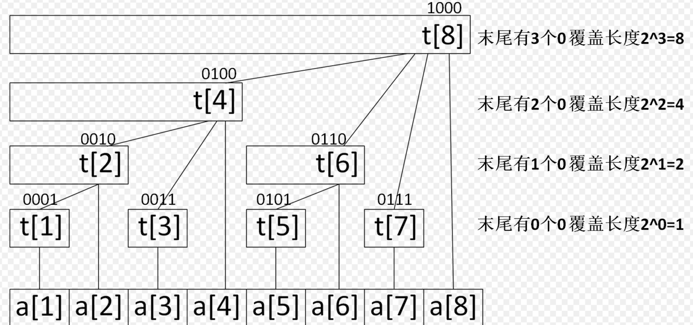

# Advance Data Structure


## Binary Indexed Tree



树状数组解决的问题：在数组的元素值可以动态变化的情况下，高效查询区间和。

关键点：利用下标的二进制特点来巧妙存储区间值，下标末尾有 k 个 0，那么该位置存储的区间长度就是 2^k。

查找二进制中的第一个 1 的位置：使用 lowbit 技术，本质上就是利用了原码与补码的性质。补码为源码取反加一，所以补码中第一次出现 1 的位置，就是反码为 0 的位置，也就是原码第一次为 1 的位置。故可以得到

```c++
int lowbit(int x) {
    return x & (-x);
}
```

所以查询前 x 个元素前缀和，就是累加 `t[x], x -= lowbit(x)` 直到 x 全零，也就是刚刚覆盖了 x 个元素。

查询和修改的时间复杂度都是 O(logn)